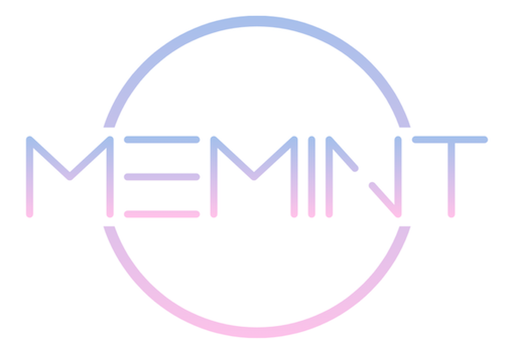

## 1. 팀 소개

- 팀 명: PEOPLE CHAIN
- 프로젝트 명: MEMINT
- 팀원: 임혜정, 이종석, 김성현, 조은민
- Github Repository
  [https://github.com/codestates/BEB-04-PeopleChain](https://github.com/codestates/BEB-04-PeopleChain)

## 2. 프로젝트 소개

# MEMINT

`MEET + MINT`

**미팅**하고 **민팅**하자

## “Blockchain for Everyone”

몇 년 전부터 블록체인은 미래를 선도할 기술로 주목받아 왔지만 실제 사용 사례는 턱없이 부족합니다. 디앱은 블록체인 기술을 상용화할 수 있는 수단이 될 것이라는 시장의 기대가 있었음에도 불구하고, 게임, 베팅, 덱스에 집중되어 있어 블록체인이나 암호화폐에 관심을 둔 사람들의 전유물일 뿐입니다. 아무리 좋은 기술이어도 실생활에 적용할 수 없다면 의미가 없습니다.

**MEMINT는 모두를 위한 블록체인을 지향합니다.**

일반인도 쉽게 접근하고, 즐기고, 사용할 수 있는 디앱을 만들어 블록체인 시장의 확장을 최우선 가치로 두고 프로젝트를 기획했습니다. 이러한 관점에서 일반 대중들이 쉽게, 부담없이 즐기는 문화로 자리 잡은 ‘데이팅앱'을 기반으로 프로젝트를 발전시키게 되었습니다.

## “Dating App”

국내 모바일 데이팅 시장은 2010년 스마트폰이 상용화될 때부터 성장해 2018년 약 2천억원 규모이며, 2021년 - 22년 평균 월간 순이용자 수(MAU) 177만명으로 꾸준히 성장하고 있습니다. (출처: 모바일인덱스) 디지털 네이티브인 젠지(Gen-Z)의 유입과 온라인 구애 활동에 대한 선호가 높아지는 사회적 분위기로 국내 모바일 데이팅 시장은 꾸준히 성장할 전망입니다.

그러나 데이팅 앱에 허점은 여전히 많습니다.

- 플랫폼 생태계에 부적합한 활동을 방지하기 어려움 (무분별한 좋아요, 노쇼 등)
- 플랫폼에 머무를 유인 요소 부족 (짧은 앱 사용 주기)
- 단기 이익을 극대화하기 위한 기업의 부정 행위 (유령 회원 생성 등)

MEMINT는 미팅에 토큰 이코노미 요소를 활용해 위와 같은 문제를 해결하고자 합니다.

## “Meeting App with Token Economy”

**Token Economy**

토큰 이코노미는 토큰을 이용한 경제 시스템입니다. 어떠한 행동을 유인하기 위해 보상으로 토큰을 주고, 그 토큰으로 구성원들이 건강한 생태계를 구축해나가도록 합니다. 선순환 구조의 토큰 이코노미가 형성되기 위해서는 토큰의 수요와 공급, 앱 내 서비스 및 재화와 토큰의 교환 비율, 토큰의 가치 등에 촘촘한 설계가 필요합니다.

**Token Economy in MEMINT**

MEMINT는 **Date 2 Earn** 서비스 입니다.

재미있게 게임을 하면서 토큰을 벌 수 있는 P2E, 운동을 하며 토큰을 벌 수 있는 M2E 처럼, D2E는 좋은 인연도 만날 수 있는 계기를 만들어 주면서 토큰으로 유/무형의 경제적 가치 또한 창출할 수 있습니다.

기존 Web2 데이팅앱과의 **차별점은 토큰 생태계 참여자들에 의해, 즉 토큰의 수요와 공급에 의해 토큰의 가치가 변한다는 것**입니다. 토큰 이코노미를 통해 생태계 내 구성원들의 행동에 즉각적이고 적절한 보상을 줄 수 있습니다.

- 토큰 채굴 시나리오
  - 미팅에 참여했음을 인증했을 경우 (GPS를 통해 인증)
  - 미팅이 끝난 후 상대방에 대한 피드백을 남겼을 경우
- 토큰 소각 시나리오
  - 미팅을 생성할 경우 (+ 친구와 함께 참여하는 경우)
  - 다른 유저의 프로필 사진을 조회했을 경우
  - 앱에서 제공하는 프로필 이미지를 민팅하는 경우

# Details

## 1. Before Meeting

- **미팅 조회** : 현재 신청이 가능한 미팅들을 조회합니다. 원하는 지역, 조건(날짜, 인원) 등을 필터링할 수 있으며 날짜 가까운 순, 위치 가까운 순, 나이 순으로 정렬할 수 있습니다.
- **미팅 신청** : 원하는 미팅을 메시지 작성과 함께 신청합니다. 미팅 호스트는 신청 알림을 받으면 거절 또는 수락을 할 수 있습니다.
- **미팅 생성** : 직접 미팅을 생성합니다. 미팅 생성에 필요한 정보 (제목, 설명, 날짜 및 시간, 지역, 인원, 태그 등)를 작성합니다. 친구와 함께 참여하고 싶다면 전체 사용자 중에서 친구 닉네임을 검색해 초대할 수 있습니다.
- **프로필 조회** : 토큰을 사용해 상대방의 실제 프로필 사진을 조회합니다.
- **채팅 기능** : 미팅에 참여자끼리 단체 톡방을 통해 대화를 나눕니다. 단체 톡방에서 미팅 일자, 시간, 장소를 확정합니다.

## 2. Meeting Starts

- **미팅 참여 인증**: 미팅에 정상적으로 참여했음을 인증합니다. 인증 후 토큰을 보상으로 받습니다.

## 3. After Meeting

- **피드백 기능** : 미팅이 끝난 후 상대에 대한 호감을 표현합니다. 피드백 결과는 상대방에게 전달됩니다. 피드백 후 토큰을 보상으로 받습니다.

## 4. Minting NFT

- **NFT 이미지 획득** : 회원가입 시 랜덤 NFT 이미지를 부여받습니다. 받은 이미지는 프로필 이미지로 활용합니다.
- **NFT 민팅** : 토큰을 사용해 현재 프로필을 NFT로 민팅합니다. 민팅하면 NFT임을 인증하는 뱃지를 부착할 수 있습니다.

## 5. Wallet

- **앱 내 토큰 입출금 정보** : 앱 내에서 토큰 사용 히스토리를 조회합니다. 내부에서 모은 토큰을 외부로 내보내기 위해 온체인 지갑에 보낼 수 있습니다. 외부에서 이더리움과 바꾼 토큰을 내부로 가져오기 위해 온체인 지갑에서 토큰을 받아올 수 있습니다.
- **토큰 받기** : 자신의 지갑 주소를 복사해 외부 거래소에서 토큰 전송 시 활용할 수 있습니다.
- **토큰 보내기**: 사용자가 보유한 토큰량 내에서 다른 지갑 주소를 입력해 다른 지갑 주소로 토큰을 전송할 수 있습니다.
- **토큰 교환하기** : 현재 지갑에서 보유하고 있는 이더리움을 LCN 으로, LCN을 이더리움으로 교환할 수 있습니다.

## Software Used

###

## DB Schema Diagram

## 3. 팀 소개

### **임혜정**

- Role: Team Leader
- Position: PM / Frontend / Backend
- Github: [https://github.com/mae-zung](https://github.com/mae-zung)
- Blog: [https://velog.io/@mae-zung](https://velog.io/@mae-zung)
- Stack: JavaScript, Node.js, React, React Native, MongoDB, Firebase
- Contributions:
  - 프로젝트 기획 (리서치, 아이디에이션, User Workflow 기획)
  - 프로젝트 관리
  - Firebase 연동 및 세팅
  - 프론트엔드 구현 : Mypage
  - 백엔드 구현 : Mypage, NFT
  - 디자인 및 레이아웃 구성
  - 프레젠테이션 기획, 발표

### 이종석

- Role: Team Member
- Position: Frontend / Backend / Blockchain
- Github: [https://github.com/jongseokleedev](https://github.com/jongseokleedev)
- Blog: [https://chacot.tistory.com/](https://chacot.tistory.com/)
- Stack: Javascript, Node.js, React-Native, Firebase, Solidity
- Contributions:
  - 토큰 이코노미 설계
  - 프로젝트 기획
  - 프로젝트 관리(Git Workflow)
  - 프론트엔드 구현 : 인증, 회원가입, Wallet
  - 백엔드 구현 : User, Wallet
  - Web3

### 김성현

- Role: Team Member
- Position: Frontend / Backend / Blockchain
- Github: [https://github.com/96sunghyun](https://github.com/96sunghyun)
- Blog: [https://www.notion.so/78b1125facd14686b6d0bed57d956e4a](https://www.notion.so/78b1125facd14686b6d0bed57d956e4a)
- Stack: Javascript, Node.js, web3, React-Native, Firebase, Solidity
- Contributions:
  - 프론트엔드 구현
    - 채팅 기능 / 페이지
  - 백엔드 구현
    - web3 기능구현

### 조은민

- Role: Team Member
- Position: Frontend / Backend
- Github: [https://github.com/eunminCho](https://github.com/eunminCho)
- Blog: [https://blog.naver.com/silvermn99](https://blog.naver.com/silvermn99)
- Stack: JavaScript, Node.js, React, React-Native, Firebase
- Contributions:
  - 프론트엔드 구현
    - common 컴포넌트 구현
    - Meeting, Alarm
  - 백엔드 구현 : Meeting, Alarm
